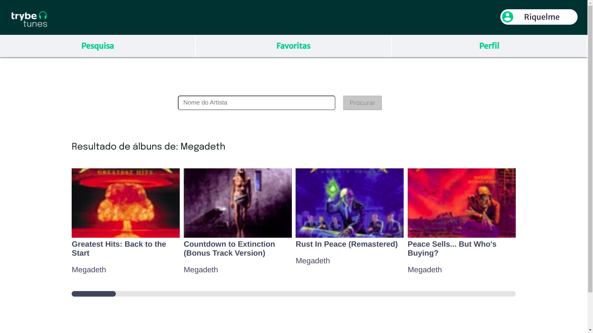

# [Projeto Trybetunes](https://riquelmebandeira.github.io/projeto-trybetunes/#/)

# Contexto
o TrybeTunes é uma aplicação capaz de reproduzir músicas das mais variadas bandas e artistas, criar uma lista de músicas favoritas e editar o perfil da pessoa usuária logada.

A aplicação foi feita com React, com base em um protótipo do Figma para o layout das telas, e é abastecida pela iTunes Search API.


## Tecnologias usadas

* React
* CSS

## Instalando o projeto

1. Clone o repositório:

```
git clone git@github.com:riquelmebandeira/projeto-trybetunes.git
```

2. Entre na pasta do repositório clonado:

```
cd projeto-trybetunes
```

3. Instale as dependências com o comando:

```
npm install
```

## Executando a aplicação

  ```
  npm start
  ```
